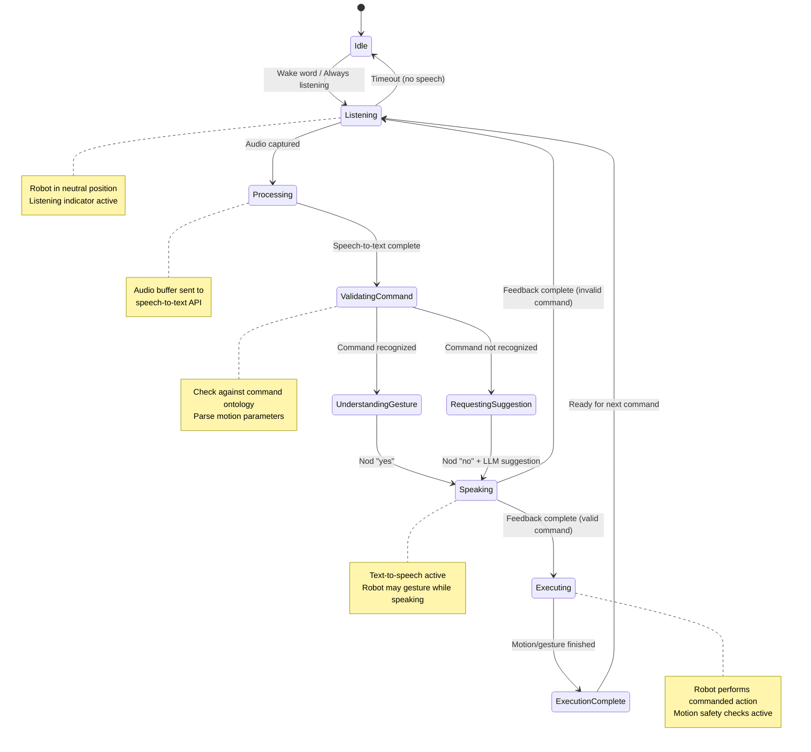

# Audio Control System for HiWonder Robot Arm

## Overview
This document outlines the architecture and implementation plan for a voice-controlled HiWonder robot arm system. The system will use a Waveshare audio USB stick with speakers to provide natural language control with visual and auditory feedback.

## System Architecture

### Core Components

1. **Audio Input/Output System**
   - Input: Waveshare USB audio device with microphone
   - Output: Speakers for feedback
   - Audio-to-text: OpenAI Whisper or similar speech recognition
   - Text-to-speech: For robot responses

2. **State Machine & Command Processor**
   - State management for listening/speaking/executing modes
   - Command validation and parsing
   - LLM-powered command interpretation and suggestions
   - Ontology mapping for motion quantities

3. **Robot Driver**
   - HiWonder arm control via xarm library
   - Joint articulation management
   - Pre-programmed gesture sequences

## State Diagram



## Command Ontology

### Motion Commands

#### Directional Movement
| Command | Joint | Action | Motion Amount |
|---------|-------|--------|---------------|
| "move left [amount]" | Base (servo 1) | Rotate counterclockwise | small/medium/large |
| "move right [amount]" | Base (servo 1) | Rotate clockwise | small/medium/large |
| "move up [amount]" | Shoulder/Elbow | Lift arm | small/medium/large |
| "move down [amount]" | Shoulder/Elbow | Lower arm | small/medium/large |
| "move forward [amount]" | Elbow | Extend reach | small/medium/large |
| "move back [amount]" | Elbow | Retract | small/medium/large |

**Motion Amounts:**
- **Small/Little**: 10-15 degrees
- **Medium/Moderate** (default): 30-45 degrees  
- **Large/Lot**: 60-90 degrees

#### Joint-Specific Control
| Command | Target Joint | Servo ID |
|---------|-------------|----------|
| "rotate base [direction] [amount]" | Base rotation | 1 |
| "move shoulder [direction] [amount]" | Shoulder | 2 |
| "move elbow [direction] [amount]" | Elbow | 3 |
| "move wrist [direction] [amount]" | Wrist | 4 |

#### Gripper Control
| Command | Action |
|---------|--------|
| "grasp" / "grab" / "close gripper" | Close gripper (servo 5) |
| "release" / "open gripper" | Open gripper (servo 5) |

### Gesture Commands

#### Special Gestures
| Command | Description |
|---------|-------------|
| "please dance" | Pre-programmed dance sequence: wave arms, rotate base, wiggle joints |
| "please wiggle" | Rapid small oscillations of all joints |
| "please nod" | Nod gesture: tilt wrist down, pause, tilt up |

#### Feedback Gestures (Robot-initiated)
| Gesture | Meaning |
|---------|---------|
| Single nod | "Yes, I understand" |
| Head shake (base rotation) | "No, I don't understand" |

### System Commands
| Command | Action |
|---------|--------|
| "center" / "home" / "reset" | Return all joints to center position |
| "stop" / "emergency stop" | Halt all motion immediately |
| "repeat" | Repeat last command |

## Implementation Status

✅ **COMPLETED** - All phases have been implemented!

The complete voice-controlled robot arm system is now ready in `/audio-control/`.

### What's Been Built:

1. ✅ **Audio System**: Waveshare USB capture, Whisper STT, OpenAI TTS
2. ✅ **State Machine**: Full state flow with callbacks and transitions
3. ✅ **Command Parser**: Natural language ontology with 3 motion amounts
4. ✅ **LLM Integration**: GPT-4 powered command suggestions
5. ✅ **Robot Driver**: Extended HiWonder controller with gestures
6. ✅ **Gesture Library**: Dance, wiggle, nod, shake, wave
7. ✅ **Feedback System**: Synchronized speech + gestures (nod yes/no)
8. ✅ **Main Application**: Complete integration with error handling

### Quick Start:

```bash
cd audio-control
./start.sh
```

Or manually:
```bash
cd audio-control
# Add your OPEN_AI_KEY to .env
pip install -r requirements.txt
cd src && python main.py
```

### Testing Individual Components:

All modules have demo functions:
- `python src/audio/capture.py` - Test audio capture
- `python src/audio/speech_to_text.py recording.wav` - Test STT
- `python src/control/ontology.py` - Test command parsing
- `python src/robot/gestures.py` - View gesture library
- `python src/llm/command_assistant.py` - Test LLM suggestions

See the full README at `/audio-control/README.md` for detailed documentation.

