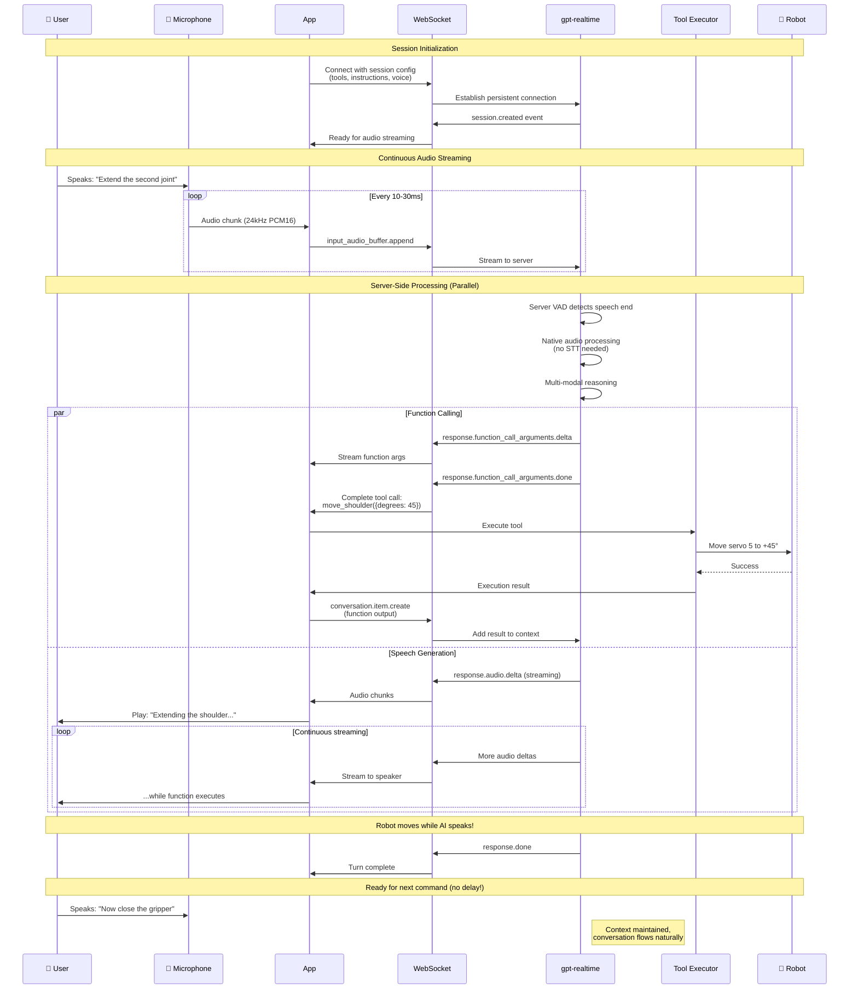
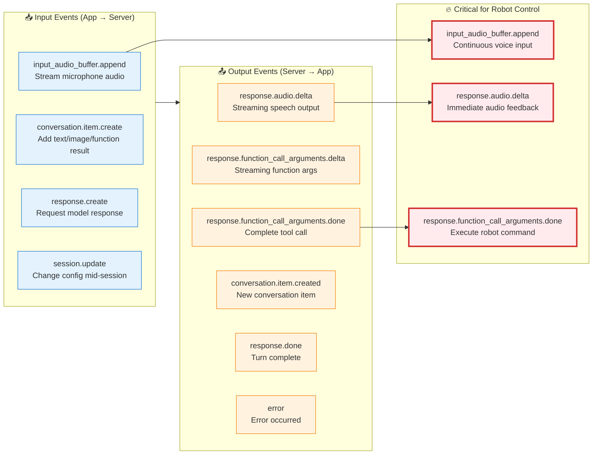
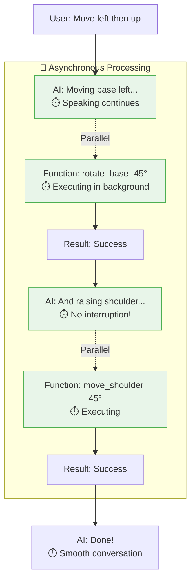
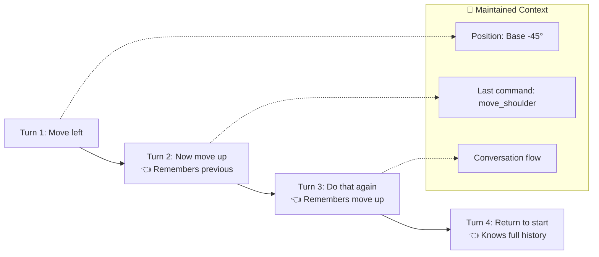
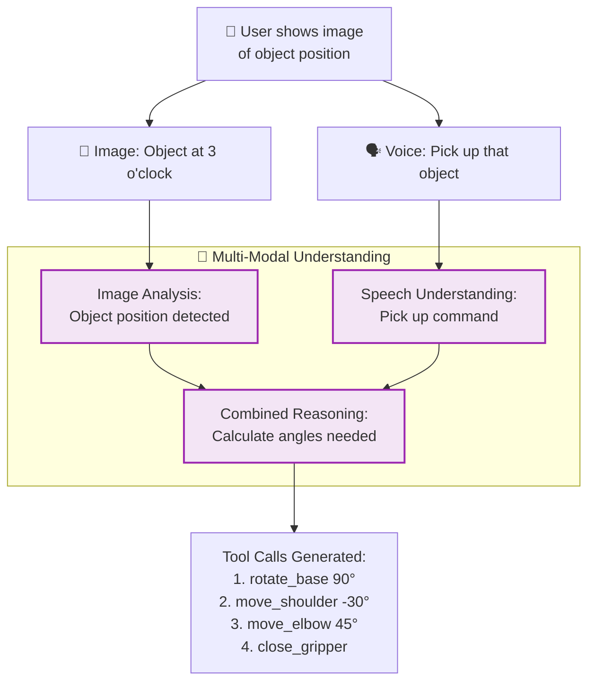
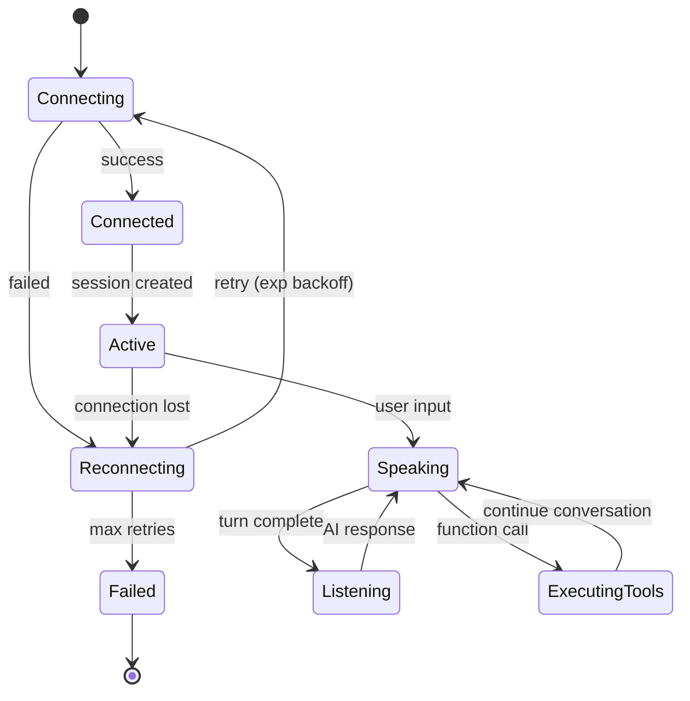
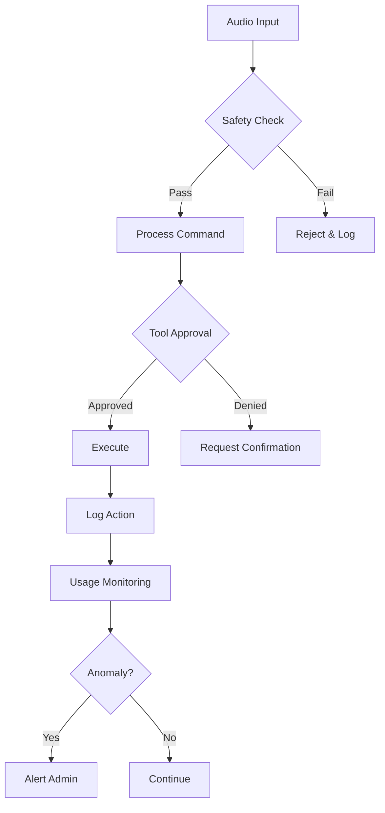

# Streaming Audio Control with GPT-4o Realtime API

## Overview

The new **gpt-realtime** model (August 2025) provides native speech-to-speech processing with:
- ⚡ **Sub-second latency** (typically 200-500ms)
- 🎯 **66.5% function calling accuracy** (up from 49.7%)
- 🗣️ **Natural speech** with improved audio quality
- 🔧 **Asynchronous function calling** (no conversation disruption)
- 📸 **Image input support**
- 🌐 **MCP server integration**
- 💰 **20% cheaper** ($32/1M input, $64/1M output tokens)

---

## System Architecture Diagram

```mermaid
flowchart TB
    subgraph User["👤 User Environment"]
        MIC[🎤 Microphone<br/>24kHz PCM16]
        SPEAKER[🔊 Speaker<br/>24kHz PCM16]
        CAMERA[📸 Camera<br/>Optional Images]
    end
    
    subgraph App["💻 Robot Control Application"]
        AUDIO_IN[Audio Input Stream<br/>PyAudio Capture]
        AUDIO_OUT[Audio Output Stream<br/>PyAudio Playback]
        WS_CLIENT[WebSocket Client<br/>Persistent Connection]
        IMG_HANDLER[Image Handler<br/>Base64 Encoding]
        EVENT_ROUTER[Event Router<br/>Handle Server Events]
        TOOL_EXEC[Tool Executor<br/>Execute Robot Commands]
        ROBOT_STATE[Robot State Manager<br/>Track Positions & Queue]
    end
    
    subgraph OpenAI["☁️ OpenAI Realtime API"]
        WS_SERVER[WebSocket Server<br/>wss://api.openai.com/v1/realtime]
        
        subgraph Session["Session Context"]
            SYSTEM[System Instructions<br/>Robot Embodiment<br/>Action-First Philosophy]
            TOOLS[Tool Definitions<br/>15+ Robot Functions]
            HISTORY[Conversation History<br/>Multi-turn Context]
            IMAGES[Image Context<br/>Visual Grounding]
        end
        
        subgraph Model["🤖 gpt-realtime Model"]
            VAD[Server-Side VAD<br/>500ms silence threshold]
            AUDIO_PROC[Native Audio Processing<br/>No STT/TTS Chain]
            REASONING[Multi-Modal Reasoning<br/>Audio + Text + Images]
            FUNC_CALL[Function Call Generation<br/>66.5% accuracy]
            SPEECH_GEN[Natural Speech Generation<br/>8 voices + Cedar/Marin]
        end
        
        MCP[MCP Server Support<br/>Optional External Tools]
    end
    
    subgraph Robot["🤖 HiWonder Robot Arm"]
        SERVO_CTRL[Servo Controller<br/>5-DOF Joint Control]
        BASE[Base Joint ID:6<br/>Rotate Left/Right]
        SHOULDER[Shoulder Joint ID:5<br/>Up/Down]
        ELBOW[Elbow Joint ID:4<br/>Forward/Back]
        WRIST[Wrist Joint ID:3<br/>Tilt Up/Down]
        GRIPPER[Gripper ID:1<br/>Open/Close]
    end
    
    %% Audio Flow
    MIC -->|Stream Audio Chunks| AUDIO_IN
    AUDIO_IN -->|Append to Buffer| WS_CLIENT
    WS_CLIENT <-->|Bidirectional<br/>WebSocket| WS_SERVER
    WS_SERVER -->|Audio Delta Events| WS_CLIENT
    WS_CLIENT -->|Audio Chunks| AUDIO_OUT
    AUDIO_OUT -->|Play Streaming| SPEAKER
    
    %% Image Flow
    CAMERA -.->|Optional Visual Context| IMG_HANDLER
    IMG_HANDLER -.->|Base64 Image| WS_CLIENT
    
    %% Server Processing
    WS_SERVER --> Session
    Session --> Model
    Model --> VAD
    VAD --> AUDIO_PROC
    AUDIO_PROC --> REASONING
    REASONING --> FUNC_CALL
    REASONING --> SPEECH_GEN
    
    %% Function Calling Flow
    FUNC_CALL -->|Function Call Event| WS_CLIENT
    WS_CLIENT -->|Parse Tool Call| EVENT_ROUTER
    EVENT_ROUTER -->|Execute Tool| TOOL_EXEC
    TOOL_EXEC -->|Update State| ROBOT_STATE
    TOOL_EXEC -->|Send Commands| SERVO_CTRL
    
    %% Robot Actions
    SERVO_CTRL --> BASE
    SERVO_CTRL --> SHOULDER
    SERVO_CTRL --> ELBOW
    SERVO_CTRL --> WRIST
    SERVO_CTRL --> GRIPPER
    
    %% Function Result Flow
    TOOL_EXEC -->|Function Result| WS_CLIENT
    WS_CLIENT -->|Result to Context| HISTORY
    
    %% Speech Generation
    SPEECH_GEN -->|Audio Stream| WS_SERVER
    
    %% MCP Integration
    TOOLS -.->|Optional External Tools| MCP
    MCP -.->|Auto-handled| FUNC_CALL
    
    %% Visual styling
    classDef userClass fill:#e1f5ff,stroke:#0077cc,stroke-width:2px
    classDef appClass fill:#fff4e6,stroke:#ff9800,stroke-width:2px
    classDef openaiClass fill:#f3e5f5,stroke:#9c27b0,stroke-width:2px
    classDef robotClass fill:#e8f5e9,stroke:#4caf50,stroke-width:2px
    classDef criticalPath fill:#ffebee,stroke:#f44336,stroke-width:3px
    
    class MIC,SPEAKER,CAMERA userClass
    class AUDIO_IN,AUDIO_OUT,WS_CLIENT,EVENT_ROUTER,TOOL_EXEC appClass
    class WS_SERVER,Model,Session openaiClass
    class SERVO_CTRL,BASE,SHOULDER,ELBOW,WRIST,GRIPPER robotClass
    class FUNC_CALL,REASONING criticalPath
```



---

## Event Flow Sequence



---

## Detailed Event Types



---

## Key Features for Robot Control

### 1. Asynchronous Function Calling


**Benefit**: Long robot movements don't block conversation flow!

### 2. Multi-Turn Context Retention


### 3. Image-Grounded Commands


---

## Implementation Code Structure

### 1. Session Configuration
```python
# POST /v1/realtime/client_secrets
session_config = {
    "model": "gpt-realtime",  # New model (Aug 2025)
    "voice": "cedar",  # Or: marin, alloy, echo, etc.
    
    # Audio format
    "input_audio_format": "pcm16",
    "output_audio_format": "pcm16",
    
    # Server-side VAD (faster than local)
    "turn_detection": {
        "type": "server_vad",
        "threshold": 0.5,
        "prefix_padding_ms": 300,
        "silence_duration_ms": 500  # Only 500ms wait!
    },
    
    # System instructions (your embodiment prompt)
    "instructions": """You are controlling a 5-DOF robot arm.
    
    YOUR EMBODIMENT:
    1. BASE (Joint 1, ID 6) - rotate_base
    2. SHOULDER (Joint 2, ID 5) - move_shoulder
    3. ELBOW (Joint 3, ID 4) - move_elbow
    4. WRIST (Joint 4, ID 3) - move_wrist
    5. GRIPPER (Joint 5, ID 1) - open/close_gripper
    
    NATURAL LANGUAGE MAPPING:
    - "second joint" = SHOULDER
    - "extend" = positive degrees (up/forward)
    
    ACTION-FIRST: Always execute commands confidently.""",
    
    # Robot control tools
    "tools": [
        {
            "type": "function",
            "name": "rotate_base",
            "description": "Rotate the robot base left or right",
            "parameters": {
                "type": "object",
                "properties": {
                    "degrees": {
                        "type": "number",
                        "description": "Degrees to rotate (negative=left, positive=right)"
                    }
                },
                "required": ["degrees"]
            }
        },
        # ... 14 more robot tools
    ],
    
    # Optional: MCP server for additional tools
    "tools": [
        {
            "type": "mcp",
            "server_label": "robot_extras",
            "server_url": "https://your-mcp-server.com",
            "require_approval": "never"
        }
    ],
    
    # Cost control
    "max_response_output_tokens": 500,
    "temperature": 0.6
}
```

### 2. Event Handling Loop
```python
async def handle_realtime_events(websocket, robot_controller):
    """Main event loop for Realtime API"""
    
    audio_output_stream = setup_speaker()
    
    async for event in websocket:
        event_type = event.get("type")
        
        # === Audio Output (Streaming) ===
        if event_type == "response.audio.delta":
            # Play audio immediately as it arrives
            audio_chunk = base64.b64decode(event["delta"])
            audio_output_stream.write(audio_chunk)
        
        # === Function Calling ===
        elif event_type == "response.function_call_arguments.done":
            # Execute robot command
            tool_name = event["name"]
            arguments = json.loads(event["arguments"])
            call_id = event["call_id"]
            
            print(f"🤖 Executing: {tool_name}({arguments})")
            
            # Execute on robot
            result = robot_controller.execute_tool(tool_name, arguments)
            
            # Send result back to maintain conversation flow
            await websocket.send(json.dumps({
                "type": "conversation.item.create",
                "item": {
                    "type": "function_call_output",
                    "call_id": call_id,
                    "output": json.dumps(result)
                }
            }))
        
        # === Conversation Updates ===
        elif event_type == "conversation.item.created":
            item = event["item"]
            if item["role"] == "user":
                print(f"📝 User: {item.get('content', 'audio')}")
            elif item["role"] == "assistant":
                print(f"🤖 Assistant: {item.get('content', 'audio')}")
        
        # === Turn Complete ===
        elif event_type == "response.done":
            print("✅ Turn complete, ready for next command")
        
        # === Errors ===
        elif event_type == "error":
            print(f"❌ Error: {event['error']}")
```

### 3. Audio Input Streaming
```python
async def stream_microphone_to_server(websocket):
    """Stream microphone audio to Realtime API"""
    
    # Setup audio capture (24kHz for Realtime API)
    audio = pyaudio.PyAudio()
    stream = audio.open(
        format=pyaudio.paInt16,
        channels=1,
        rate=24000,  # Realtime API requires 24kHz
        input=True,
        frames_per_buffer=4096
    )
    
    print("🎤 Streaming microphone...")
    
    while True:
        # Read audio chunk
        audio_chunk = stream.read(4096, exception_on_overflow=False)
        
        # Encode to base64
        audio_b64 = base64.b64encode(audio_chunk).decode('utf-8')
        
        # Send to server
        await websocket.send(json.dumps({
            "type": "input_audio_buffer.append",
            "audio": audio_b64
        }))
        
        await asyncio.sleep(0.01)  # Small delay
```

---

## Latency Comparison

```mermaid
gantt
    title Latency Comparison: Old System vs Realtime API
    dateFormat X
    axisFormat %Ls
    
    section Old System (9s)
    Wait for silence: 0, 2000
    Upload audio: 2000, 2500
    Whisper STT: 2500, 3000
    LLM processing: 3000, 3500
    TTS generation: 3500, 5500
    Download audio: 5500, 6000
    Start playback: 6000, 6000
    
    section Realtime API (<1s)
    Stream audio (no wait): 0, 100
    Server VAD: 100, 600
    Native audio processing: 600, 800
    Start playback: 800, 800
```



**Result**: 9 seconds → 0.8 seconds = **11x faster!** ⚡

---

## Production Considerations

### 1. Error Handling & Reconnection


### 2. Cost Management
```python
# Intelligent context truncation
session_config = {
    "max_response_output_tokens": 500,
    
    # Truncate old turns to save cost on long sessions
    "truncation_strategy": {
        "type": "auto",
        "last_messages": 10  # Keep last 10 turns
    }
}

# Use cached input tokens (87.5% cheaper)
# $32 → $0.40 per 1M cached input tokens
```

### 3. Safety & Monitoring


---

## Advantages for Robot Control

| Feature | Old System | Realtime API | Improvement |
|---------|-----------|--------------|-------------|
| **Latency** | 6-9 seconds | 0.5-1 second | **9-18x faster** |
| **Function Calling** | 49.7% accuracy | 66.5% accuracy | **34% better** |
| **Natural Speech** | Robotic | Human-like | **Major upgrade** |
| **Async Tools** | Blocks conversation | Parallel execution | **No interruption** |
| **Multi-turn Context** | Manual management | Automatic | **Easier** |
| **Image Support** | Not available | Built-in | **New capability** |
| **Cost per command** | ~$0.0002 | ~$0.001 | **5x more** |
| **Setup Complexity** | High (3 APIs) | Low (1 API) | **Simpler** |

---

## Migration Path

```mermaid
graph LR
    A[Current System<br/>main_tool_based.py<br/>9 second latency]
    B[Hybrid System<br/>--realtime flag<br/>Test & Compare]
    C[Full Realtime<br/>realtime_main.py<br/>1 second latency]
    
    A -->|1. Create new file| B
    B -->|2. Validate| C
    B -.->|Keep for fallback| A
    
    subgraph Phase1["Phase 1: Proof of Concept (4h)"]
        P1A[Setup WebSocket connection]
        P1B[Stream audio input]
        P1C[Play audio output]
        P1D[Measure latency]
    end
    
    subgraph Phase2["Phase 2: Tool Integration (4h)"]
        P2A[Define 15 robot tools]
        P2B[Handle function calls]
        P2C[Execute on robot]
        P2D[Test all commands]
    end
    
    subgraph Phase3["Phase 3: Production (2h)"]
        P3A[Error handling]
        P3B[Reconnection logic]
        P3C[Logging & monitoring]
        P3D[Documentation]
    end
    
    B --> Phase1
    Phase1 --> Phase2
    Phase2 --> Phase3
    Phase3 --> C
    
    classDef currentClass fill:#ffebee,stroke:#c62828
    classDef targetClass fill:#e8f5e9,stroke:#2e7d32
    classDef hybridClass fill:#fff3e0,stroke:#ef6c00
    
    class A currentClass
    class C targetClass
    class B hybridClass
```



---

## Recommended Next Steps

1. **Today**: Create `src/realtime_main.py` proof of concept
2. **Tomorrow**: Test latency and function calling
3. **This Week**: Full integration with robot controller
4. **Result**: Sub-second voice control! 🚀

---

## Resources

- **API Docs**: https://platform.openai.com/docs/guides/realtime
- **Playground**: Test the API in browser
- **Pricing**: $32/1M input, $64/1M output tokens (20% cheaper)
- **Model**: `gpt-realtime` (August 2025 release)

---

## Summary

The Realtime API with `gpt-realtime` model is **perfect** for robot voice control:

✅ **11x faster** than current system  
✅ **Better function calling** (66.5% accuracy)  
✅ **Natural conversation** (no robotic speech)  
✅ **Simpler architecture** (1 API vs 3)  
✅ **Production-ready** (generally available)  
✅ **Cost-effective** (despite 5x price, still cheap)  

**Recommendation**: Migrate to Realtime API for production voice control.

